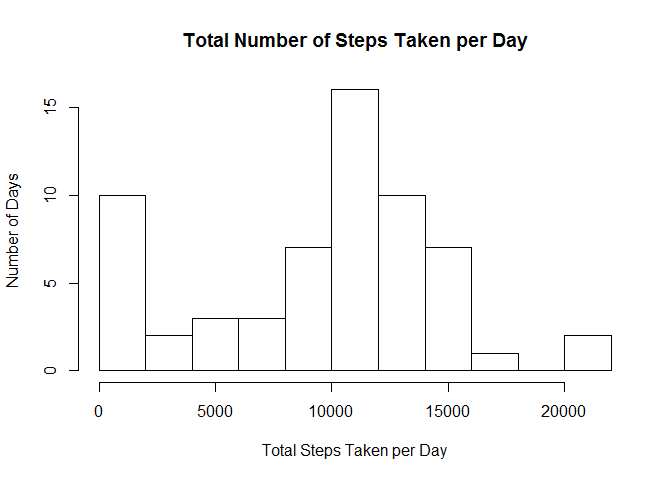
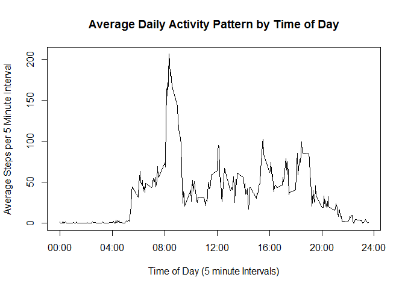
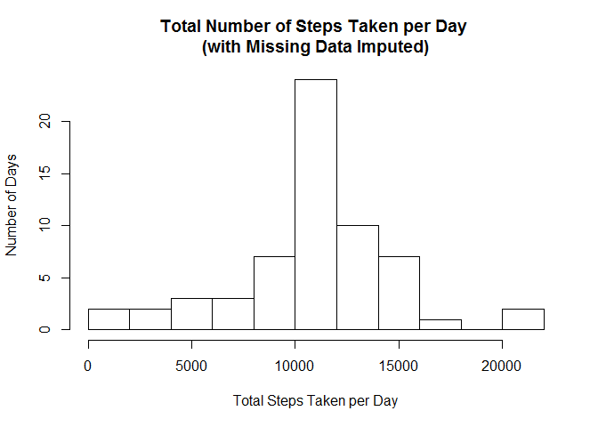
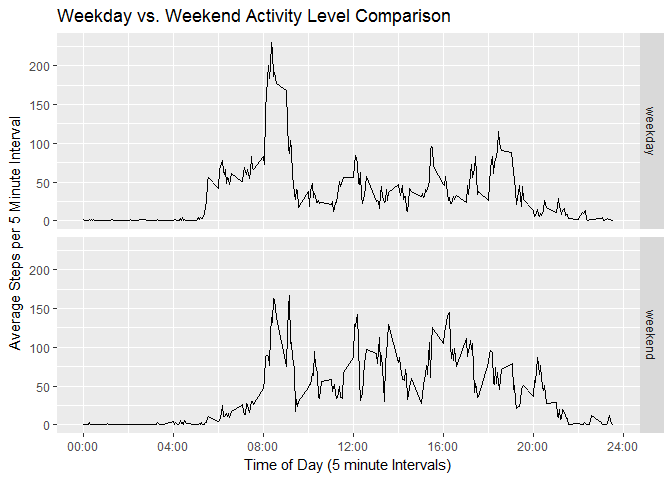

# Reproducible Research: Peer Assessment 1


## Loading and preprocessing the data

We begin by loading the data into a dataframe called "activity".  The provided datafile
"activity.zip" should be stored in the working directory.


```r
activity <- read.csv(unz("activity.zip", "activity.csv"), colClasses=c("integer","Date","integer"))
```

Next, we combine the "date" and "interval" variables in the original data to create a new
"DateTime" variable.


```r
activity$DateTime<-strptime(paste(activity$date,sprintf("%06d",activity$interval)),"%Y-%m-%d %H%M%S")
```

## What is mean total number of steps taken per day?

First we compute the total number of steps taken per day.


```r
daily_total <- tapply(activity$steps,activity$date,sum,na.rm=TRUE)
```

Next, we make a histogram of the total number of steps taken each day.


```r
hist(daily_total,breaks=seq(0,22000, by=2000),
     xlab="Total Steps Taken per Day", ylab="Number of Days",
     main="Total Number of Steps Taken per Day")
```

<!-- -->

Finally, we calculate the mean and median of the total number of steps taken per day.  As computed
by the code below, the mean number of steps per day is 9354.2 and the median
is 10395.


```r
mean(daily_total)
```

```
## [1] 9354.23
```

```r
median(daily_total)
```

```
## [1] 10395
```

## What is the average daily activity pattern?

We now construct a time series plot of the 5-minute interval (x-axis) and the average number of 
steps taken, averaged across all days (y-axis).


```r
mean_steps <- tapply(activity$steps,activity$interval,mean,na.rm=TRUE)
plot(activity$interval[1:288], mean_steps, type="l",
     main="Average Daily Activity Pattern by Time of Day", 
     xlab="Time of Day (5 minute Intervals)", ylab="Average Steps per 5 Minute Interval",
     xaxt="n")
axis(1,at=seq(0,2400,by=400),labels=c("00:00","04:00","08:00","12:00","16:00","20:00","24:00"))
```

<!-- -->

On average across all days in the dataset, the maximum number of steps occurs in the five minute 
time interval at 835, with an average of 
206.2 steps during this five minute interval.
This is determined using the code below:


```r
names(which.max(mean_steps))
```

```
## [1] "835"
```

```r
mean_steps[which.max(mean_steps)]
```

```
##      835 
## 206.1698
```

## Imputing missing values

The total number of missing values in the dataset is 2304, which can be 
determined using the code below:


```r
sum(is.na(activity$steps))
```

```
## [1] 2304
```

We will impute all of the missing values in the dataset by using the mean number of steps for 
that same 5-minute interval for all other days in the dataset which have non-missing data for that 
interval. 

The new dataset with missing data filled in is created as follows, using the strategy described 
above:


```r
activity_imputed <- activity
for (i in 1:nrow(activity_imputed)){
      if (is.na(activity_imputed$steps[i])) {
            activity_imputed$steps[i] <- 
                  mean(activity$steps[activity$interval == activity$interval[i]], na.rm=TRUE)
            }
}
```

Using the imputed data, we now construct a new histogram of the total number of steps taken each day:


```r
daily_total_imputed <- tapply(activity_imputed$steps,activity_imputed$date,sum,na.rm=TRUE)
hist(daily_total_imputed,breaks=seq(0,22000, by=2000),
     xlab="Total Steps Taken per Day", ylab="Number of Days",
     main="Total Number of Steps Taken per Day \n(with Missing Data Imputed)")
```

<!-- -->

In the original histogram (prior to filling in missing data), there were 
10 days with a total of fewer than 2000 steps, which resulted in a 
distribution which looked bimodal.  After imputing missing values, there are only 
2 such days, and the distribution no longer looks bimodal.
It seems that most of the days in the original data with very low values for the total number of 
steps actually had a large amount of missing data.

After filling in the missing data, the mean number of steps per day is 
10766 and the median is 
10766, 
as computed by the commands below:


```r
mean(daily_total_imputed)
```

```
## [1] 10766.19
```

```r
median(daily_total_imputed)
```

```
## [1] 10766.19
```

Both the mean and the median for the data with missing values imputed are higher than the values 
computed prior to filling in the missing data (which were mean = 9354.2 and 
median = 10395).  This was to be expected since we originally computed the total 
number of steps for each day by simply ignoring all missing data, which effectively assumes that 
there were 0 steps in any time interval where the data was missing.  When we fill in the missing 
data, these total values can only increase, so both the eman and the median will increase.

## Are there differences in activity patterns between weekdays and weekends?

We begin by creating a new factor variable in the dataset to indicate whether a given date is a 
weekday or weekend day.


```r
activity_imputed$weekday <- ifelse(weekdays(activity_imputed$DateTime) %in% 
                                         c("Saturday","Sunday"),"weekend","weekday")
```

Finally, we construct a panel plot containing time series plots to compare the average number of steps taken in each 5 minute time interval for weekdays vs. weekends.


```r
library(ggplot2)
```

```
## Warning: package 'ggplot2' was built under R version 3.3.2
```

```r
p <- ggplot(activity_imputed, aes(interval, steps))
p + stat_summary(fun.y="mean", geom="line") + facet_grid(weekday ~ .) +
      labs(x="Time of Day (5 minute Intervals)", y="Average Steps per 5 Minute Interval",
           title="Weekday vs. Weekend Activity Level Comparison") +
      scale_x_continuous(breaks = seq(0,2400,400),
                         labels = c("00:00","04:00","08:00","12:00","16:00","20:00","24:00"))
```

<!-- -->
